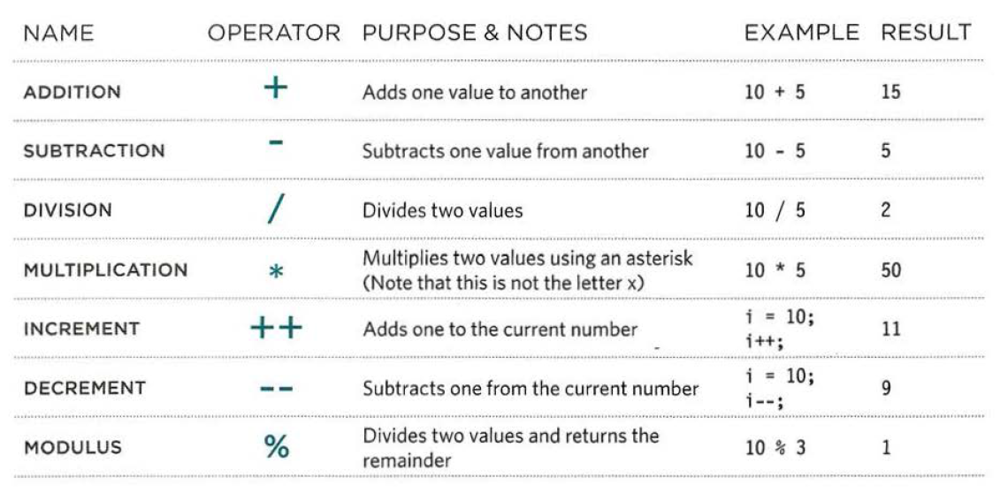

[Back to Home](README.md)

# Read 07

## JavaScript

### What is JavaScript

JavaScript is a programming that is used to make webpages interactive by modifying the content while it being viewed on the browser. JavaScript allows the developers to access any element, attribute, or text from an element page wether by using tag names, classes, or IDs, and it also gives the developer the ability to add or modify elements, attributes and text or even remome them from an HTML page.
As a programming language, to use JavaScript the developer needs to specify some rules and steps for the browser to follow and make the desired changes based on the user reactions to the website elemets or specefic events that happen to occur.

Similar to CSS, JavaScript code can be added to the HTML document either internally and externally. It can be added internally by wrapping the code between `<script>` openning tag and `</script>` closing tag. And to add it eternally, a file with the extention `.js` should be created and the code should be added into this file, and then, the file should be linked inside the HTML document.

### JavaScript Basic Instructions

JavaScript uses something called expressions to do changes in a HTML document. An expression is any valid set of literals, variables, operators, and expressions that evaluates to a single value. Some expressions just assign a value to a variable and some other expressions use two or more values to return a single value. And to create these values, expressions use something called operators. Operators allow programmers to create a single value from one or more values.

Operators has to two types: Arithmatic operators and string operators. Arethmetic operators are used can be called mathematical operators because they can be used with numbers. The image below shows a set of the arithmetic operators and examples on how to use them.



There is just one string operator which is `+`. This operator is used between to striings to concatenate them into one string. 

Example:

```
var fname = 'Husam ';
var lname = 'Ajour;
var fullName = fname + lname;
```

The result of the code above will be `Husam Ajour` because it will concatenate both string into one single string saved into the variable `fullName`.

### Functions

A function is a set of statements and expressions to perform a specific task. The idea of functions is that the developers write a piece of code once and reuse it whenever they need to instead of writing the same piece of code over and over.

Functions have two types; functions that need to be provided with information to perform the needed task and it will provide with a response after it finishes execution which is called a return value, and functions that don't need any provided data. To declare a function you need to give a name so you can call it later using that name, and if its need provided values you need to add perameters to function.

An example on a function that doesn't need any provided information:

```
function sayHello(){
    document.write('Hello');
}
```

An example on a functoin that requires provided data and it has a return value:

```
function getArea(width, height){
    return width*height;
}
```

[Back to Home](README.md)
